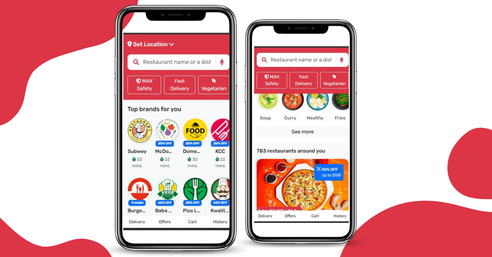
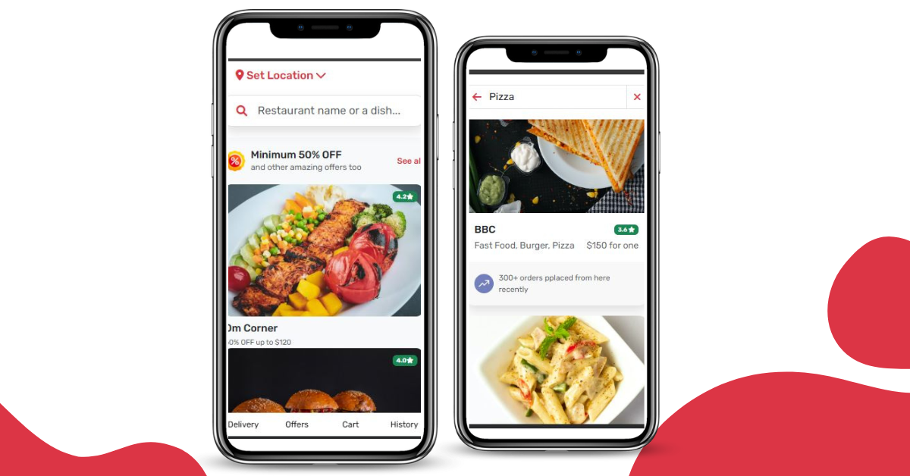
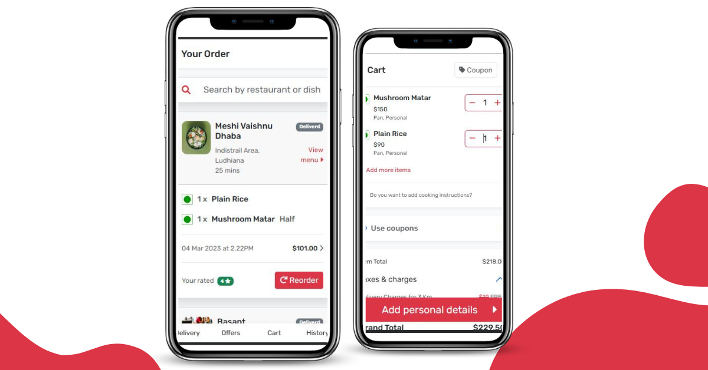

## 🖥 App Screenshots

### 🏠 Home Screen


### 🎁 Offer Screen


### 🛒 Cart & Order Screen

 
 
 # Food Delivery App

A responsive web application to browse restaurants, view menus, and place food orders online. Built using **HTML, CSS, and JavaScript**, this project demonstrates a front-end food ordering system with interactive UI elements.

## Features
- Browse restaurants and their menus
- View dishes with details
- Add items to cart (front-end simulation)
- Responsive design for mobile and desktop
- Clean and intuitive user interface

## Tech Stack
- **HTML5** – Structure and content  
- **CSS3** – Styling and layout  
- **JavaScript** – Interactivity and dynamic UI


## How to Run
1. Clone the repository:
   ```bash
    git clone https://github.com/Kavita9-git/Food-Delivery-WebApp.git


